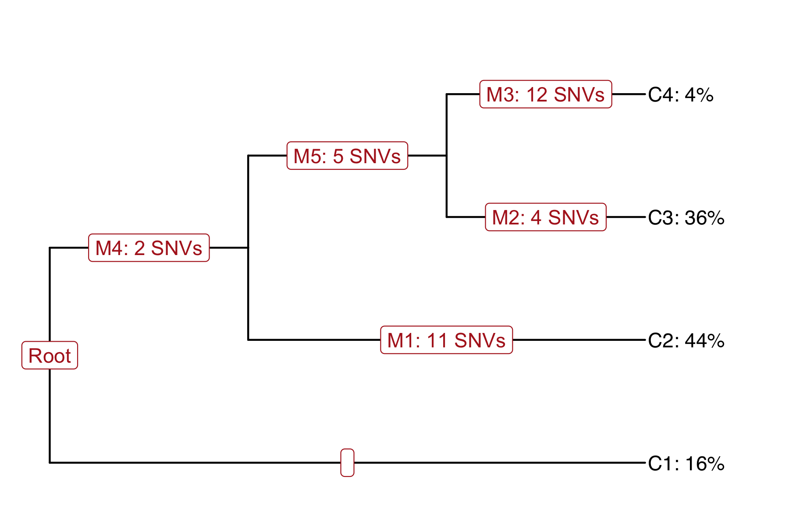

# Example data set from fibroblast cells

This example data set has 34 SNVs from 428 cells, probed by Smart-seq2 single-
cell RNA-seq.

It is produced along with the [cardelino paper](https://www.biorxiv.org/content/early/2018/11/26/413047) and alos included in the [cardelino R package](https://github.com/PMBio/cardelino/blob/master/tests/testthat/test-clone_id.R#L5)

There are three matrices:

* [A](A_snv.mtx): ALT allele count matrix
* [D](D_snv.mtx): Depth count matrix (ALT allele + REF allele)
* [Config](SNV_clone_id.tsv): Clonal structure configuration matrix, inferred 
  from bulk exome-seq by Canopy. The clonal tree structure is the following:

